# Facebook Extension App Charts & Diagrams

## System Diagram

### Basic Use Case Diagram
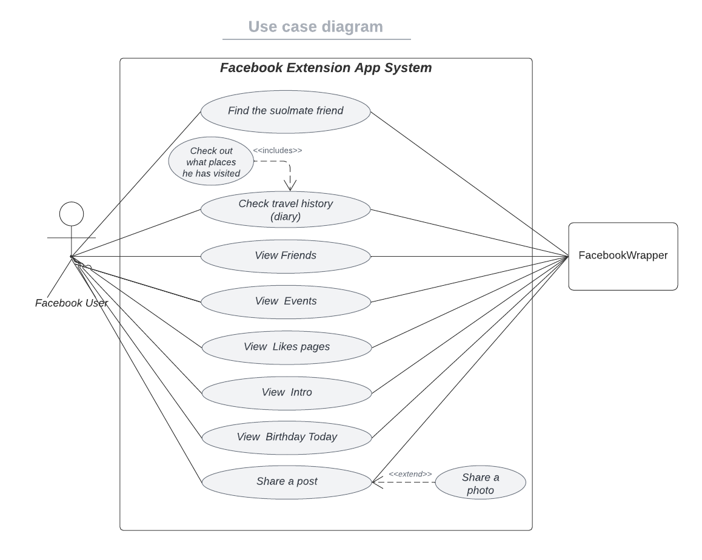

### System Sequence Diagram Travel Diary
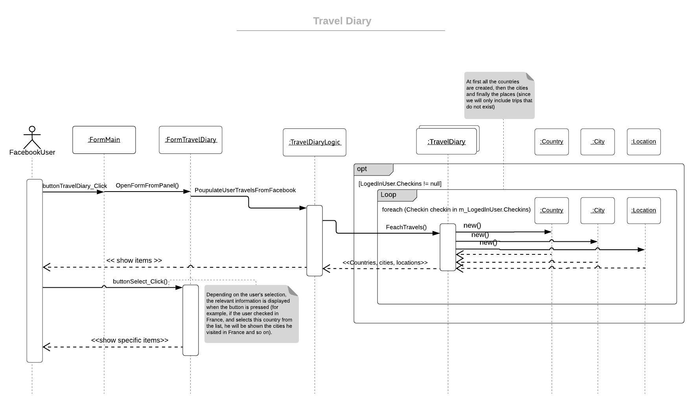

## Design Patterns

### Singleton
Based on the singleton design pattern:

Singleton :arrow_right: FacebookUser

Client :arrow_right: FormMain         

#### Sequence Diagram
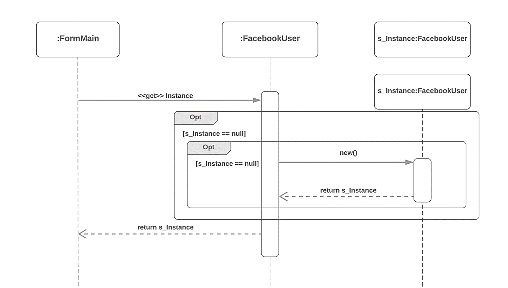

#### Class Diagram
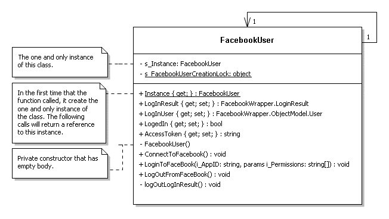

### Factory Method
Based on the Factory Method design pattern:

Client :arrow_right: FormHomePage      

StaticFactoryClass :arrow_right: PostCreator  

AbstractClass :arrow_right: FacebookPost    

ConcreteProudct1 :arrow_right: TextPost    

ConcreteProudct2 :arrow_right: PhotoPost         

#### Sequence Diagram
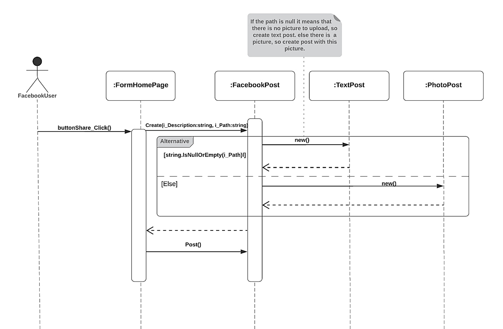

#### Class Diagram
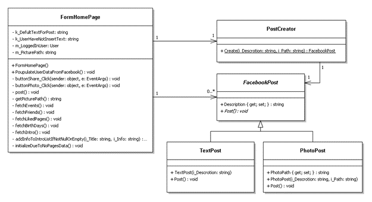

### Builder 
Based on the Builder design pattern:

Director :arrow_right: SoulmateCreator    

Builder :arrow_right: ISoulmateBuilder     

Concrete Builder :arrow_right: SoulmateFriendBuilder   

Product :arrow_right: SoulmateFriend                         

#### Sequence Diagram
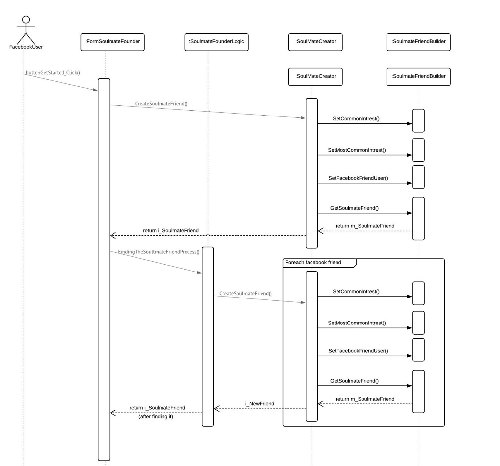

#### Class Diagram
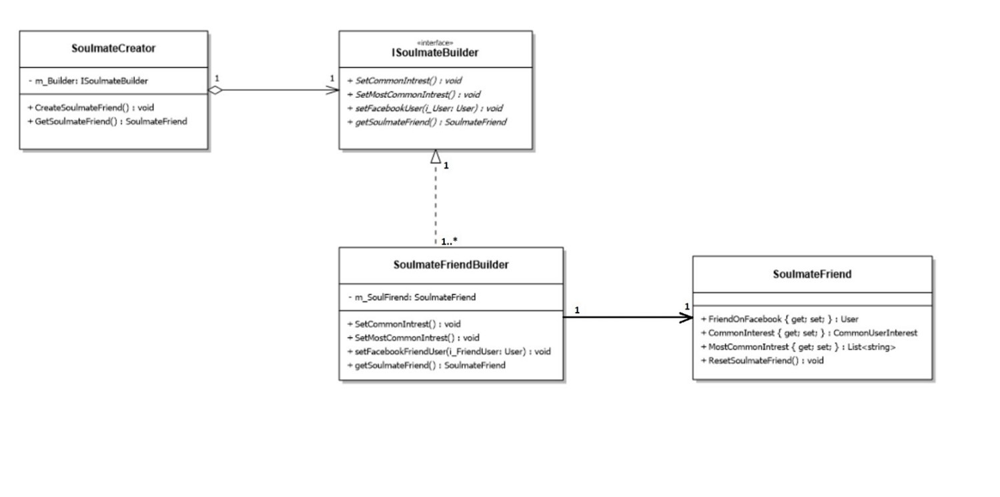

### Command 
Based on the Command design pattern:

Client :arrow_right: MainForm    

Command :arrow_right: ICommand     

ConcreteCommand :arrow_right: OpenFormFromMainFormPanelCommand      

Invoker :arrow_right: FeatureButton                         

#### Sequence Diagram
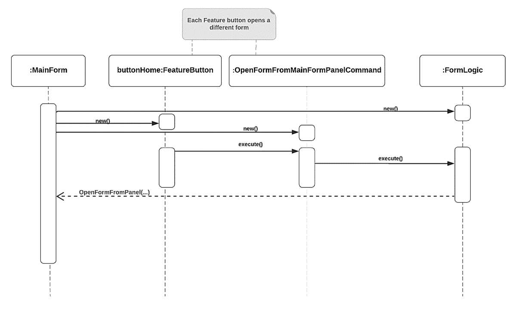

#### Class Diagram
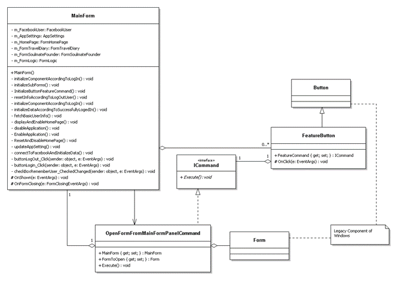

### Stratrgy 
Based on the Stratrgy design pattern:

Mechanisem  :arrow_right: SoulmateFounderLogic  

IStrategy  :arrow_right: ICountCategoryStrategy     

Strategy1 :arrow_right: MaxCategoryManager                                          

#### Sequence Diagram
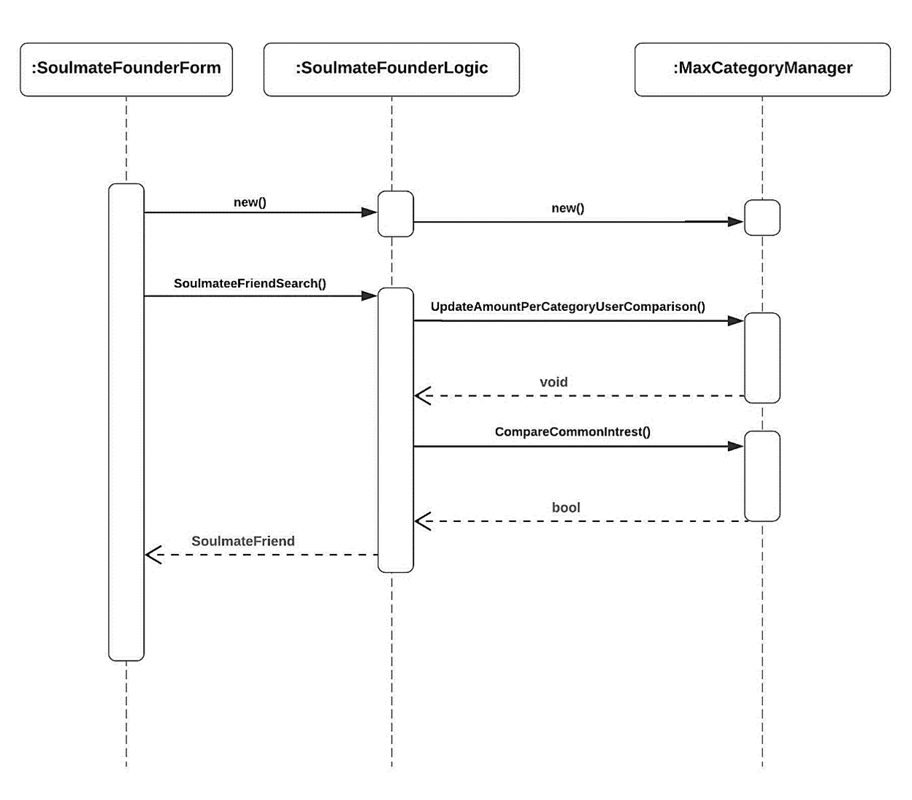

#### Class Diagram
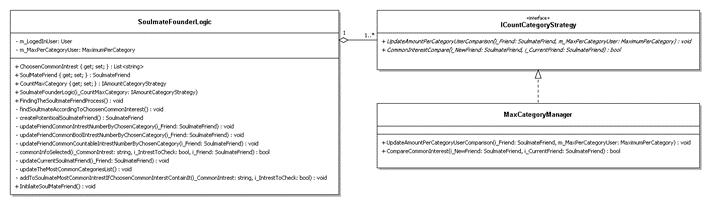

### Decorator 
Based on the Decorator design pattern:

IComponent   :arrow_right: IPictureDecorated      

SomeCoreComponent  :arrow_right: PictureCoreDecoratoed    

Decorator :arrow_right: PictureDecorator     

ConcreteDecoratorOne :arrow_right: FlickeringPicture       

ConcretDecoratorTwo :arrow_right: RoundEdgesPicture                                           

#### Sequence Diagram
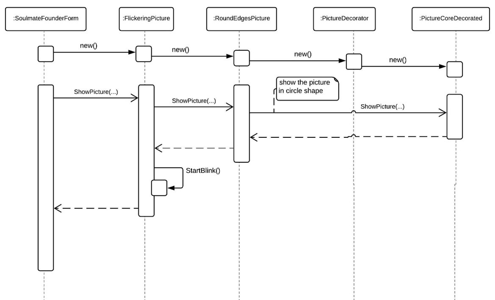

#### Class Diagram
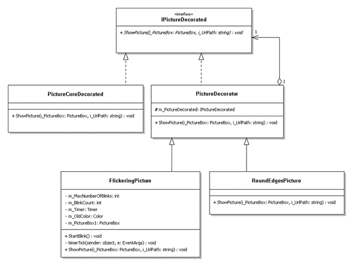
